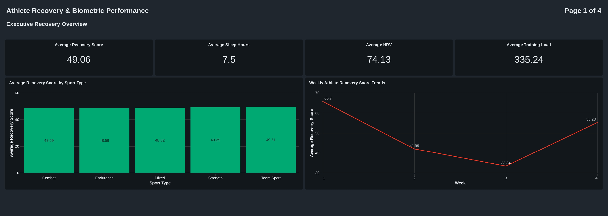
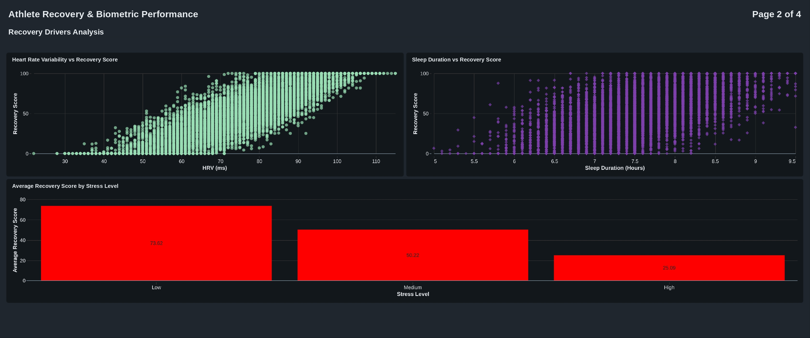
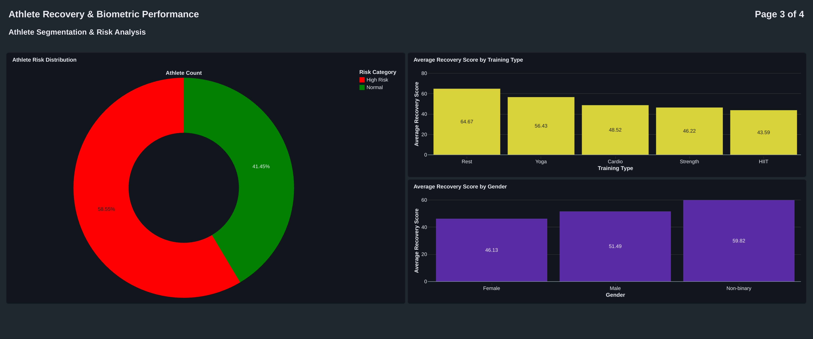
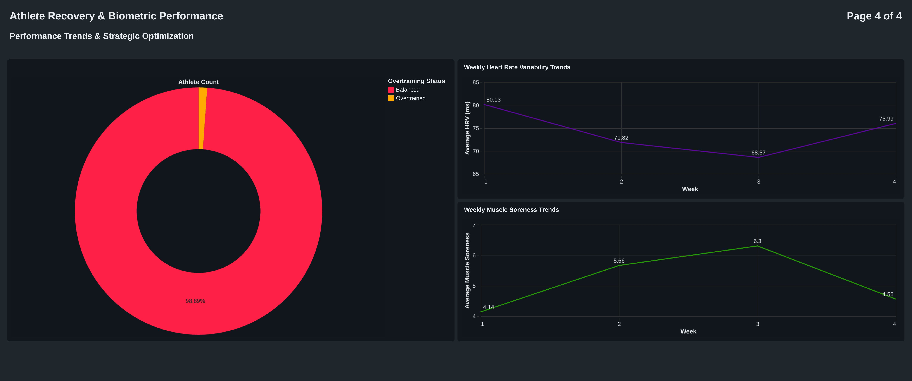

# 🏋️ Athlete Recovery & Biometric Performance Intelligence Analysis

> A strategic end-to-end Databricks SQL analytics project analyzing wearable biometrics, recovery performance, physiological readiness, behavioral stressors, and overtraining risks to optimize athlete sustainability in Sports Science & HealthTech.

---

## 📌 Overview
Modern sports organizations increasingly rely on wearable biometric technologies to monitor athlete readiness, but fragmented recovery, physiological, and behavioral datasets often prevent leadership from fully understanding which factors truly drive sustainable performance.

This project transforms 8,379 longitudinal athlete performance observations across 300 athletes into strategic sports intelligence by integrating:

- Recovery performance  
- Sleep sustainability  
- Heart rate variability (HRV)  
- Stress burden  
- Training intensity  
- Muscle soreness  
- Demographic segmentation  
- Overtraining detection  

Using Databricks as a full-stack analytics platform, this project provides sports organizations, performance teams, and HealthTech stakeholders with scalable business intelligence to identify hidden recovery vulnerabilities, personalize athlete optimization strategies, and proactively reduce burnout risk.

---

## 🎯 Business Problem
Sports organizations must continuously optimize athletic performance while balancing increasingly complex physiological and behavioral factors.

Leadership teams need visibility into:

- Which recovery drivers most significantly impact athlete readiness  
- How stress and behavioral variables suppress performance  
- Which training modalities create sustainable outcomes  
- Which demographic groups may require personalized interventions  
- How cumulative fatigue develops over time  
- Where overtraining risks emerge before severe decline occurs  

Without integrated analytics, organizations risk:

- Sustained under-recovery  
- Overtraining  
- Burnout accumulation  
- Poor training-recovery balancing  
- Missed preventive intervention opportunities  
- Reduced athlete longevity  
- Generalized recovery strategies that fail key athlete segments  

This project converts fragmented wearable biometric data into strategic sports performance intelligence that supports smarter recovery planning and long-term athlete optimization.

---

## 📊 Dashboard Preview

### 💼 Dashboard 1: Executive Recovery Overview

### 💤 Dashboard 2: Recovery Drivers Analysis

### 👥 Dashboard 3: Athlete Segmentation & Risk Analysis

### 📈 Dashboard 4: Performance Trends & Strategic Optimization

---

## 🧠 Key Insights

- Athletes recorded an average **49.06 recovery score**, indicating widespread systemic under-recovery
- **58.55%** of athlete observations were classified as **High Risk**
- Recovery declined sharply from **65.7 in Week 1** to **33.34 in Week 3**, signaling cumulative fatigue accumulation
- HRV declined from **80.13 to 68.57**, while muscle soreness rose from **4.14 to 6.3**, validating worsening physiological strain
- High-stress athletes averaged only **25.09 recovery score**, compared to **73.62** for low-stress athletes
- HIIT training generated the poorest recovery outcomes (**43.59**), while Rest (**64.67**) and Yoga (**56.43**) significantly improved readiness
- Female athletes recorded the lowest recovery performance (**46.13**) among all gender groups
- Non-binary athletes recorded the strongest recovery (**59.82**), suggesting potential demographic recovery disparities
- Sport type alone showed minimal predictive variation, reinforcing the importance of individualized biometric strategies
- 93 athlete records were flagged as overtrained, supporting preventive intervention opportunities

---

## 🛠 Methodology

- Databricks Bronze/Silver/Gold lakehouse architecture  
- SQL-based raw data ingestion, cleaning, and transformation  
- Schema validation and profiling  
- Median imputation by Sport Type + Training Type  
- Feature engineering:
  - Training Load  
  - Sleep Deficit  
  - Recovery Categories  
  - Athlete Risk Flags  
  - Overtraining Flags  
  - Weekly Recovery Metrics  
- Exploratory Data Analysis (EDA) across:
  - Recovery trends  
  - HRV trends  
  - Stress-performance relationships  
  - Gender segmentation  
  - Training-type optimization  
  - Longitudinal fatigue accumulation  
- Databricks dashboard development across four executive dashboards  
- Strategic stakeholder-focused business interpretation  

---

## 📈 Business Recommendations

### Prioritize Recovery Cycle Optimization
Implement structured recovery recalibration during Weeks 2–3 where cumulative fatigue and physiological decline peak most significantly.

### Expand Restorative Training Modalities
Increase strategic inclusion of restorative modalities such as rest days, yoga, and active recovery to offset excessive high-intensity exposure.

### Reduce Excessive HIIT Dependency
Rebalance HIIT-heavy programming with more sustainable recovery structures to prevent long-term readiness degradation.

### Institutionalize HRV & Soreness Monitoring
Integrate HRV decline and muscle soreness escalation into daily performance systems as leading indicators of burnout and overtraining.

### Build Gender-Responsive Recovery Strategies
Develop more personalized recovery frameworks that better address observed gender-based disparities, particularly among female athletes.

### Integrate Psychological Stress Management
Treat behavioral stress as a central performance KPI alongside physical metrics to improve total athlete recovery optimization.

### Develop Predictive Recovery Systems
Expand into machine learning-powered athlete forecasting, burnout prediction, and personalized intervention engines.

---

## 🛠 Tools Used

### Databricks:
- SQL Warehousing  
- Dashboard Development  
- Lakehouse Architecture  
- Bronze/Silver/Gold Data Engineering Pipelines  
- KPI Monitoring  

### SQL:
- CTEs  
- CASE Statements  
- COALESCE  
- Aggregate Functions  
- Window Functions  
- LEFT JOINs  
- Feature Engineering  
- Median Imputation  
- Risk Segmentation  
- KPI Development  

### Data Analytics:
- Exploratory Data Analysis (EDA)  
- Wearable biometric intelligence  
- Sports performance analytics  
- Behavioral health modeling  
- Risk detection  
- Longitudinal fatigue monitoring  
- Strategic business storytelling  

---

## 📊 Data Source
This project uses a synthetic athlete wearable biometric dataset designed for machine learning, sports science analytics, and performance intelligence applications.

- Source: Kaggle Athlete Recovery & Biometric Performance Dataset  

The dataset was cleaned, transformed, and engineered to simulate real-world athlete monitoring, recovery optimization, and performance management scenarios.

---

## 📁 Files Included
- Athlete Recovery Report (PDF)  
- Databricks Dashboard Screenshots  
- Source CSV Dataset  

---

## 💡 Key Takeaway
Athletic performance alone does not determine sustainable success.

Long-term athlete optimization depends on balancing:

- Recovery quality  
- Behavioral stress management  
- Physiological monitoring  
- Training intensity  
- Demographic personalization  
- Predictive intervention planning  

This project demonstrates how data analytics can transform wearable biometric complexity into proactive sports performance intelligence.

---

⭐️ *Turning wearable biometrics into strategic athlete performance intelligence.*
